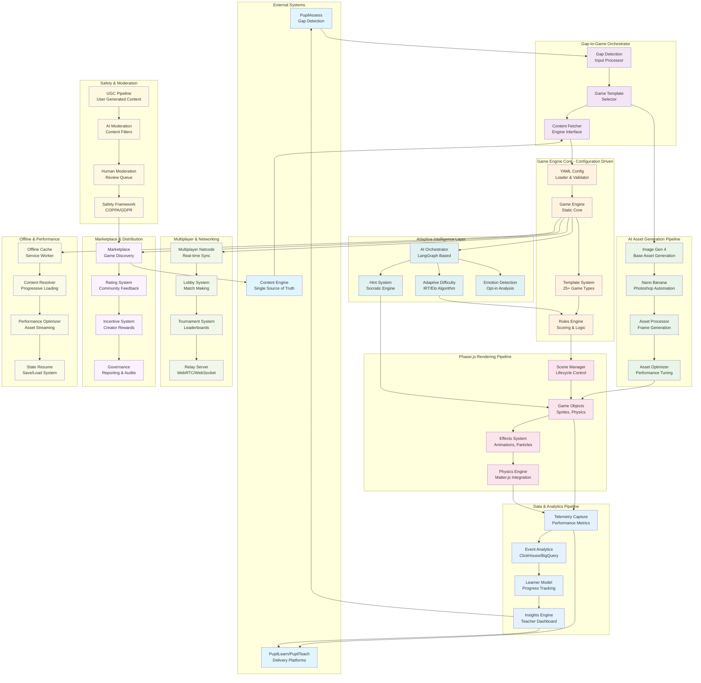

# PupilPlay Game Engine - Comprehensive Workflow & Architecture

## Mermaid Workflow Diagram



## Architecture Overview

### Core Philosophy: Configuration-Driven Game Engine

Following the automation engine pattern, PupilPlay operates on a **Configuration-Over-Code** architecture where:

- **Static Engine Core**: The Phaser.js-based engine remains unchanged
- **Dynamic Game Logic**: All gameplay, rules, and behaviors defined in YAML configurations
- **AI-Powered Orchestration**: LangGraph manages complex game flows and adaptivity
- **Pluggable Systems**: Modular components connected via standardized interfaces

### Key Architectural Principles

1. **Separation of Concerns**: Clear boundaries between rendering, logic, AI, and configuration
2. **Hot-Swappable Configuration**: Real-time game updates without engine restarts
3. **AI-First Design**: Intelligence built into every layer of the system
4. **Offline-First Architecture**: Progressive web app with comprehensive caching
5. **Safety-by-Design**: Built-in moderation and compliance at every level

## Technology Stack Integration

### Frontend Layer
- **React** (Teacher interfaces)
- **Flutter** (Student mobile apps)
- **Phaser.js** (Game rendering and physics)
- **Unity WebGL** (Advanced 3D games)

### Backend Services
- **FastAPI** (REST APIs and game logic)
- **Node.js** (Real-time multiplayer)
- **Redis** (Caching and pub/sub)
- **Kafka** (Event streaming)

### AI & Intelligence
- **LangGraph** (Workflow orchestration)
- **Gemini 2.5 Flash Image** (Asset generation via Nano Banana)
- **Image Gen 4** (Base image generation)
- **Custom IRT/Elo** (Adaptive difficulty)

### Data & Analytics
- **PostgreSQL** (Game metadata)
- **MongoDB** (Game states)
- **ClickHouse** (Real-time analytics)
- **BigQuery** (Long-term insights)

## Detailed Component Analysis

### 1. Gap-to-Game Orchestrator

**Purpose**: Transforms educational gaps into playable game experiences

**Components**:
- **Gap Detection Input Processor**: Receives assessment data from PupilAssess
- **Game Template Selector**: AI-powered matching of gaps to optimal game templates
- **Content Fetcher**: Retrieves curriculum-aligned content from Content Engine

**YAML Configuration**:
```yaml
gap_to_game:
  processors:
    - gap_type: "multiplication_facts"
      preferred_templates: ["math_runner", "number_puzzle", "calculation_battle"]
      difficulty_mapping:
        novice: 1-5
        intermediate: 6-12
        advanced: 13-25
  content_filters:
    age_appropriate: true
    curriculum_aligned: true
    accessibility_compliant: true
```

### 2. AI Asset Generation Pipeline

**Purpose**: Automated creation and optimization of 2D game assets

**Workflow**:
1. **Image Gen 4**: Generates base game assets from text prompts
2. **Nano Banana**: Photoshop-style editing and refinement
3. **Asset Processor**: Creates animation frames and variants
4. **Asset Optimizer**: Compresses and optimizes for web delivery

**Example Integration**:
```yaml
asset_generation:
  base_generator: "image_gen_4"
  editor: "nano_banana"
  processing:
    animation_frames: 8
    variants: ["idle", "walking", "jumping", "celebrating"]
    formats: ["webp", "png", "svg"]
  optimization:
    compression: "aggressive"
    lazy_loading: true
    progressive_enhancement: true
```

### 3. Game Engine Core (Configuration-Driven)

**Static Components**:
- Engine initialization and lifecycle management
- Asset loading and memory management
- Performance monitoring and optimization

**Dynamic Components (YAML-Driven)**:
- Game rules and scoring logic
- Template selection and instantiation
- Player progression algorithms

**Configuration Structure**:
```yaml
game_config:
  template: "math_runner"
  version: "1.2.0"

  gameplay:
    objective: "Collect correct multiplication answers while avoiding wrong ones"
    win_conditions:
      - type: "score"
        threshold: 1000
      - type: "accuracy"
        minimum: 80

  difficulty:
    algorithm: "elo_based"
    starting_elo: 1200
    adjustment_factor: 32

  assets:
    character: "ninja_cat"
    environment: "forest_temple"
    collectibles: "math_gems"

  physics:
    gravity: 300
    jump_strength: 400
    collision_detection: "arcade"
```

### 4. Phaser.js Rendering Pipeline

**Scene Management**:
- Dynamic scene loading based on YAML configuration
- State persistence across scene transitions
- Memory-efficient asset management

**Game Object System**:
- Component-based entity architecture
- Physics integration with Matter.js
- Sprite animation and effects system

**Performance Optimization**:
- Object pooling for frequent instantiation
- Texture atlasing for reduced draw calls
- Progressive asset loading

### 5. Adaptive Intelligence Layer

**LangGraph Orchestration**:
```yaml
intelligence_workflow:
  nodes:
    - name: "difficulty_assessor"
      type: "ai_node"
      model: "gemini_flash"
      prompt: "Analyze player performance and suggest difficulty adjustment"

    - name: "hint_generator"
      type: "ai_node"
      model: "gemini_pro"
      prompt: "Generate Socratic hints based on player's mistake pattern"

    - name: "emotion_analyzer"
      type: "ai_node"
      model: "custom_classifier"
      input: ["facial_expression", "interaction_patterns"]

  edges:
    - from: "difficulty_assessor"
      to: "game_adjuster"
      condition: "performance_change_detected"
```

### 6. Multiplayer Architecture

**Real-time Networking**:
- WebRTC for peer-to-peer gameplay
- WebSocket fallback for relay server
- Authoritative server for anti-cheat

**Scalability Design**:
- Horizontal scaling via Kubernetes
- Regional game servers
- Dynamic load balancing

**Configuration Example**:
```yaml
multiplayer:
  max_players: 4
  game_modes:
    - name: "cooperative"
      description: "Work together to solve math problems"
      victory_condition: "team_score"

    - name: "competitive"
      description: "Race to answer math questions first"
      victory_condition: "individual_score"

  networking:
    protocol: "webrtc_with_websocket_fallback"
    tick_rate: 30
    lag_compensation: true
    rollback_frames: 3
```

### 7. Safety & Moderation Pipeline

**Multi-Layer Approach**:
1. **AI Pre-filtering**: Automatic content analysis
2. **Behavioral Monitoring**: Real-time player interaction analysis
3. **Human Review**: Escalation queue for edge cases
4. **Community Reporting**: Player-driven safety system

**Compliance Framework**:
```yaml
safety_config:
  compliance:
    - standard: "COPPA"
      features: ["parental_consent", "limited_data_collection"]
    - standard: "GDPR"
      features: ["right_to_erasure", "data_portability"]

  moderation:
    ai_filters:
      - type: "toxicity"
        threshold: 0.7
      - type: "inappropriate_content"
        threshold: 0.8

    human_review:
      escalation_triggers: ["ai_uncertainty", "user_report"]
      response_time_sla: "2_hours"
```

## Performance Targets & Optimization

### Core Performance Metrics
- **Single Player**: <150ms p95 response time
- **Multiplayer**: <250ms p95 response time
- **Time to First Play**: <2.5s on 4G connection
- **Concurrent Users**: 50k CCU scaling capability

### Optimization Strategies

1. **Asset Optimization**:
   - WebP format with PNG fallback
   - Sprite sheet atlasing
   - Progressive image loading
   - CDN distribution

2. **Code Optimization**:
   - Tree shaking for minimal bundle size
   - Lazy loading of game modules
   - Web Workers for background processing
   - Service Worker for offline capabilities

3. **Network Optimization**:
   - Delta compression for multiplayer
   - Predictive asset preloading
   - Regional server deployment
   - HTTP/2 push for critical resources

## Development Workflow

### Configuration-First Development

1. **Define Game Requirements** → YAML configuration
2. **Generate Base Assets** → Image Gen 4 + Nano Banana
3. **Configure Game Logic** → Template system + rules engine
4. **Test & Iterate** → Hot-reload configuration changes
5. **Deploy** → Zero-downtime deployment with A/B testing

### Quality Assurance

- **Automated Testing**: Configuration validation, performance benchmarks
- **AI-Powered QA**: Automated gameplay testing, balance detection
- **Accessibility Testing**: WCAG 2.1 AA compliance validation
- **Security Testing**: Penetration testing, compliance audits

## Scalability & Future-Proofing

### Horizontal Scaling Capabilities
- **Microservice Architecture**: Independent scaling of game components
- **Database Sharding**: Player data distributed across multiple databases
- **CDN Integration**: Global asset distribution with edge caching
- **Auto-scaling**: Kubernetes-based dynamic resource allocation

### Extension Points
- **Custom Game Templates**: Plugin system for new game types
- **Third-party Integrations**: Open API for external tools
- **Advanced AI Models**: Swappable intelligence components
- **Platform Expansion**: Cross-platform deployment ready

This architecture provides a robust, scalable foundation for PupilPlay that can adapt to changing educational needs while maintaining high performance and safety standards.
