# PupilPlay Game Engine - Two-Node LangGraph Architecture

## PupilPlay Two-Node LangGraph Architecture

```mermaid
graph TB
    subgraph "External Educational Ecosystem"
        PA[PupilAssess<br/>Gap Detection & Analysis]
        CE[Content Engine<br/>Curriculum & Standards]
        LMS[Learning Management<br/>Systems Integration]
    end
    
    subgraph "Gap-to-Game Intelligence"
        GD[Gap Processor<br/>Educational Analysis]
        GT[Template Selector<br/>AI-Powered Matching]
        CG[Config Generator<br/>YAML Assembly]
    end
    
    subgraph "🎯 LANGGRAPH TWO-NODE CORE"
        subgraph "Node 1: Game Master"
            GM[🧠 Game Master<br/>Educational AI Tutor]
            MS[Model Selector<br/>Gemini Pro/Flash]
            SP[System Prompt<br/>All Educational Logic]
        end
        
        subgraph "Node 2: Game Actions"
            GA[⚡ Game Actions<br/>Execution Hub]
            ET[Educational Tools<br/>Hints, Difficulty, Content]
            GT_TOOLS[Game Tools<br/>State, Inventory, Progress]
            AT[Asset Tools<br/>Nano Banana Pipeline]
            AN[Analytics Tools<br/>Learning Insights]
        end
        
        %% Static Workflow (NEVER changes)
        GM -.->|LangGraph tools_condition| GA
        GA --> GM
    end
    
    subgraph "AI Asset Generation Pipeline"
        IG4[Image Gen 4<br/>Base Asset Creation]
        NB[Nano Banana<br/>Photoshop Automation]
        AO[Asset Optimizer<br/>Web Performance]
    end
    
    subgraph "Phaser.js Game Rendering"
        PH[Phaser Engine<br/>Static Core]
        SC[Scene Manager<br/>Configuration-Driven]
        GO[Game Objects<br/>Sprites & Physics]
        FX[Effects System<br/>Animations]
    end
    
    subgraph "Learning Analytics & Insights"
        LA[Learning Analytics<br/>Real-time Tracking]
        PI[Progress Insights<br/>Educational Outcomes]
        TD[Teacher Dashboard<br/>Class Overview]
        PR[Parent Reports<br/>Home Communication]
    end
    
    subgraph "Safety & Compliance"
        SM[Safety Monitor<br/>AI Content Filtering]
        CM[Compliance Manager<br/>COPPA/GDPR]
        HR[Human Review<br/>Escalation Queue]
    end
    
    %% External Integration Flow
    PA --> GD
    CE --> GT
    LMS --> CG
    
    %% Configuration Assembly
    GD --> GT
    GT --> CG
    CG --> SP
    
    %% Two-Node Workflow (Core Pattern)
    SP --> GM
    GM --> MS
    ET --> GA
    GT_TOOLS --> GA
    AT --> GA
    AN --> GA
    
    %% Asset Generation Coordination
    AT --> IG4
    IG4 --> NB
    NB --> AO
    AO --> GO
    
    %% Game Rendering Pipeline
    GA --> PH
    PH --> SC
    SC --> GO
    GO --> FX
    
    %% Analytics & Insights Flow
    GA --> LA
    LA --> PI
    PI --> TD
    PI --> PR
    TD --> LMS
    
    %% Safety & Moderation
    GM --> SM
    GA --> SM
    SM --> HR
    HR --> CM
    CM --> LMS
    
    %% Feedback Loops
    LA --> PA
    PI --> CE
    
    classDef external fill:#e1f5fe,stroke:#0277bd,stroke-width:2px
    classDef intelligence fill:#e8f5e8,stroke:#2e7d32,stroke-width:2px
    classDef twonode fill:#fff3e0,stroke:#f57c00,stroke-width:3px
    classDef assets fill:#fce4ec,stroke:#c2185b,stroke-width:2px
    classDef rendering fill:#e3f2fd,stroke:#1976d2,stroke-width:2px
    classDef analytics fill:#f3e5f5,stroke:#7b1fa2,stroke-width:2px
    classDef safety fill:#fff8e1,stroke:#f9a825,stroke-width:2px
    
    class PA,CE,LMS external
    class GD,GT,CG intelligence
    class GM,MS,SP,GA,ET,GT_TOOLS,AT,AN twonode
    class IG4,NB,AO assets
    class PH,SC,GO,FX rendering
    class LA,PI,TD,PR analytics
    class SM,CM,HR safety
```



## Two-Node Architecture: The Heart of PupilPlay

### 🎯 **Static Workflow, Dynamic Intelligence**

Following the automation engine's proven pattern, PupilPlay uses an **immutable two-node LangGraph structure**:

1. **Game Master Node**: Educational AI tutor (replaces Assistant Node)
2. **Game Actions Node**: Execution hub (replaces Tools Node) 
3. **LangGraph's `tools_condition`**: Built-in routing (no custom logic needed)

### 🏗️ **Why This Architecture is Revolutionary for Educational Gaming**

#### **Universal Game Engine**
- **Single Codebase**: Same two nodes power math runners, word puzzles, chemistry labs, and multiplayer battles
- **Hot-Swappable Logic**: Change entire game mechanics by swapping YAML configuration files
- **Infinite Scalability**: Add new subjects, age groups, and game types without touching code

#### **Configuration-Over-Code Philosophy**
All game intelligence lives in the **system prompt template** (loaded from YAML):

```python
# ALL educational logic is configuration-driven
system_prompt = config.system_prompt_template.format(
    subject=config.subject,
    game_type=config.game_type,
    player_age=player.age,
    learning_gaps=player.identified_gaps,
    available_tools=", ".join(available_game_actions)
)
```

## 🧠 **Node 1: Game Master (Educational AI Tutor)**

### **Core Responsibilities**
- **Socratic Teaching**: Guide discovery through strategic questioning
- **Adaptive Tutoring**: Real-time assessment and personalized support
- **Emotional Intelligence**: Encourage persistence and celebrate progress
- **Curriculum Alignment**: Ensure all interactions support learning objectives

### **Gemini Model Selection** (Same as Automation Engine)
```python
def select_educational_model(complexity_score: float) -> ChatGoogleGenerativeAI:
    if complexity_score >= 0.6:  # Complex explanations, creative content
        return gemini_pro_with_circuit_breaker()
    else:  # Quick feedback, routine interactions  
        return gemini_flash_with_circuit_breaker()
```

### **Educational System Prompt Structure**
Every subject gets specialized prompts loaded from configuration:

```yaml
# Math Game Master Configuration
system_prompt_template: |
  You are an expert mathematics educator embedded in "{game_name}".
  
  EDUCATIONAL CONTEXT:
  - Student: {player_name}, age {player_age}
  - Subject: {subject}, Topic: {current_topic}
  - Learning Gaps: {identified_gaps}
  - Current Performance: {recent_accuracy}% accuracy
  
  AVAILABLE GAME ACTIONS:
  {available_game_actions}
  
  TEACHING PHILOSOPHY:
  - Use Socratic questioning to guide discovery
  - Celebrate effort and progress, not just correct answers
  - Provide hints that guide thinking, never direct answers
  - Maintain 80% success rate for confidence building
```

## ⚡ **Node 2: Game Actions (Execution Hub)**

### **Tool Categories** (Equivalent to MCP Tools)

#### **Educational Tools**
- `adjust_difficulty`: Real-time challenge calibration
- `generate_hint`: Context-aware learning support  
- `create_educational_content`: Dynamic curriculum-aligned problems
- `assess_understanding`: Invisible knowledge probing
- `provide_explanation`: Multi-modal concept clarification

#### **Game Mechanics Tools**
- `update_game_state`: Player progress and achievements
- `trigger_celebration`: Success animations and positive reinforcement
- `manage_inventory`: Educational rewards and unlocks
- `save_progress`: Persistent learning achievements

#### **AI Asset Generation Tools**
- `generate_visual_asset`: Nano Banana + Image Gen 4 pipeline
- `create_character_variation`: Personalized avatar customization
- `design_environment_element`: Dynamic educational environments

#### **Analytics & Integration Tools**
- `record_learning_interaction`: Educational outcome tracking
- `sync_external_systems`: PupilAssess, Content Engine, LMS integration
- `generate_insights`: Learning pattern analysis and recommendations

## 🎮 **Game Type Specializations Through Configuration**

### **Mathematics Games**
```yaml
game_master_specialization: "mathematics_tutor"
teaching_approaches: ["visual_conceptual", "pattern_recognition", "real_world_applications"]
primary_tools: ["generate_math_problem", "provide_visual_hint", "assess_number_sense"]
```

### **Science Laboratory Games**
```yaml
game_master_specialization: "inquiry_facilitator"  
teaching_approaches: ["hypothesis_driven", "observation_based", "safety_first"]
primary_tools: ["design_safe_experiment", "guide_scientific_reasoning", "connect_real_world"]
```

### **Language Arts Games**
```yaml
game_master_specialization: "literacy_coach"
teaching_approaches: ["balanced_literacy", "phonics_based", "comprehension_focused"]
primary_tools: ["generate_vocabulary_challenge", "provide_reading_support", "assess_comprehension"]
```

### **History & Social Studies Games**
```yaml
game_master_specialization: "perspective_facilitator"
teaching_approaches: ["inquiry_based", "multiple_perspectives", "chronological_thinking"]
primary_tools: ["analyze_primary_sources", "compare_viewpoints", "construct_timelines"]
```

## 🚀 **Key Advantages of Two-Node Architecture**

### **For Educators**
1. **Zero Programming Required**: All customization through intuitive YAML files
2. **Instant Game Creation**: New educational games deployed in minutes
3. **A/B Testing**: Compare teaching approaches scientifically without code changes
4. **Curriculum Alignment**: Built-in standards mapping and progress tracking

### **For Developers**  
1. **Single Universal Engine**: One codebase serves all educational domains
2. **Hot-Swappable Configuration**: Update game mechanics without deployments
3. **Proven Architecture**: Based on successful automation engine pattern
4. **AI-First Development**: Intelligence built into every decision point

### **For Students**
1. **Personalized Learning**: AI adapts to individual needs and learning styles
2. **Engaging Content**: AI-generated assets keep experiences fresh and relevant
3. **Seamless Support**: Educational assistance naturally integrated into gameplay
4. **Progress Visibility**: Clear understanding of learning achievements and growth

## 📊 **Performance & Scalability**

### **Efficient Resource Usage**
- **Model Selection**: Route simple interactions to Gemini Flash, complex to Gemini Pro
- **Caching Strategy**: Cache similar educational interactions for faster responses
- **Asset Optimization**: Generate once, reuse across multiple game instances
- **State Management**: Minimal state design following automation engine patterns

### **Horizontal Scaling**
- **Microservice Ready**: Each component independently scalable
- **Database Sharding**: Player data distributed for optimal performance  
- **CDN Integration**: Global asset delivery with intelligent caching
- **Auto-scaling**: Kubernetes-based dynamic resource allocation

## 🛡️ **Safety & Compliance Integration**

### **Built-in Educational Safety**
- **Age-Appropriate Content**: Automatic filtering based on target demographics
- **Learning-Focused Interactions**: All conversations directed toward educational outcomes
- **Progress Transparency**: Parents and teachers have full visibility into learning activities
- **Privacy-by-Design**: Minimal data collection with comprehensive protection

### **Regulatory Compliance**
- **COPPA Compliant**: Child privacy protection built into every interaction
- **GDPR Ready**: Data portability and right to erasure automatically supported
- **FERPA Aligned**: Educational record privacy maintained across all systems

## 🎯 **Implementation Workflow**

### **Configuration-First Development**
1. **Define Learning Objectives** → Educational requirements analysis
2. **Select Game Template** → AI-powered template matching  
3. **Configure System Prompts** → Subject-specific teaching strategies
4. **Generate Assets** → Nano Banana + Image Gen 4 pipeline
5. **Deploy & Monitor** → Real-time performance and learning analytics

### **Quality Assurance**
- **Educational Effectiveness**: AI-powered learning outcome validation
- **Accessibility Compliance**: WCAG 2.1 AA automatic verification
- **Performance Benchmarks**: < 150ms response time for educational interactions
- **Safety Verification**: Content appropriateness and privacy protection testing

This two-node architecture transforms educational gaming from static experiences into dynamic, intelligent, and deeply personalized learning adventures that adapt in real-time to each student's unique needs and learning journey.