# 🎮 PupilPlay Game Engine - Two-Node Examples

This directory demonstrates how to create educational games using the **two-node LangGraph architecture** - the same proven pattern used by the automation engine.

## 🎯 **Two-Node Pattern Overview**

Every PupilPlay game uses the same simple, powerful architecture:

```mermaid
graph LR
    GM[🧠 Game Master<br/>Educational AI Tutor] 
    GA[⚡ Game Actions<br/>Execution Hub]
    
    GM -.->|LangGraph tools_condition| GA
    GA --> GM
    
    classDef master fill:#e8f5e8,stroke:#2e7d32,stroke-width:2px
    classDef actions fill:#fff3e0,stroke:#f57c00,stroke-width:2px
    
    class GM master
    class GA actions
```



### **Why This Architecture Works**

1. **Universal**: Same two nodes power ALL game types
2. **Simple**: No custom routing logic - uses LangGraph's built-in `tools_condition`
3. **Configurable**: All game logic lives in YAML, not code
4. **Proven**: Based on successful automation engine pattern

## 📚 **Simple Examples**

### 🔢 **Math Runner** (`math_games/simple_math_runner.yaml`)
**Basic endless runner with multiplication practice**

```yaml
# Game Master teaches multiplication through Socratic questioning
system_prompt_template: |
  You are a friendly math tutor in the "Math Runner" game.
  Help {player_name} master multiplication through fun gameplay!

# Game Actions handle difficulty, hints, problems, progress, celebrations
game_actions_node:
  educational_tools:
    - adjust_difficulty
    - generate_hint  
    - create_problem
    - update_progress
    - trigger_celebration
```

**Key Features:**
- **Adaptive Difficulty**: Real-time adjustment based on performance
- **AI Hints**: Context-aware mathematical guidance
- **Progress Tracking**: Mastery of multiplication tables 2-12
- **Asset Generation**: Nano Banana creates character and environment

### 📝 **Word Builder** (`language_games/simple_word_game.yaml`)
**Interactive vocabulary building game**

```yaml
# Game Master acts as literacy coach
system_prompt_template: |
  You are a helpful literacy coach in the "Word Builder" game.
  Help {player_name} become a word wizard!

# Game Actions manage vocabulary challenges
game_actions_node:
  educational_tools:
    - adjust_difficulty
    - generate_hint
    - create_word_puzzle
    - explain_meaning
    - update_vocabulary
```

**Key Features:**
- **Vocabulary Expansion**: Age-appropriate word challenges
- **Spelling Practice**: Interactive letter manipulation
- **Reading Comprehension**: Context-based word learning
- **AI-Generated Puzzles**: Dynamic word challenges

## 🔧 **Configuration-Driven Development**

### **Step 1: Define Educational Goals**
```yaml
game_definition:
  name: "Your Game Name"
  subject: "mathematics"  # or "language_arts", "science", etc.
  learning_objectives:
    - "Specific skill to master"
    - "Measurable learning outcome"
```

### **Step 2: Configure Game Master**
```yaml
game_master_node:
  system_prompt_template: |
    You are an expert {subject} educator.
    Your teaching approach: {teaching_philosophy}
    Available tools: {available_game_actions}
```

### **Step 3: Define Game Actions**
```yaml
game_actions_node:
  educational_tools:
    - name: "your_tool"
      description: "What this tool does educationally"
```

### **Step 4: AI Asset Generation**
```yaml
asset_generation:
  character:
    base_prompt: "Description for Image Gen 4"
  environment:
    base_prompt: "Scene description for AI generation"
```

## 🚀 **Running an Example**

1. **Select Configuration**:
   ```bash
   cd examples/math_games/
   cp simple_math_runner.yaml ../../active_config.yaml
   ```

2. **Set Environment Variables**:
   ```bash
   export GEMINI_API_KEY="your_key_here"
   export IMAGE_GEN4_API_KEY="your_key_here"
   ```

3. **Start Game Engine**:
   ```bash
   python -m pupilplay.engine --config=active_config.yaml
   ```

## 🎯 **Creating New Games**

### **Template Structure**
Every game follows this pattern:

```yaml
# Basic game information
domain: "educational_games"
game_type: "your_game_type"
game_definition: { ... }

# Two-node LangGraph configuration  
langgraph_orchestration:
  game_master_node: { ... }    # Educational AI logic
  game_actions_node: { ... }   # Game execution tools

# Asset generation with AI
asset_generation: { ... }

# Phaser.js rendering
phaser_config: { ... }

# Safety and compliance
safety_config: { ... }
```

### **Subject Specializations**

#### **Mathematics Games**
```yaml
game_master_node:
  teaching_approaches: ["visual_conceptual", "pattern_recognition"]
  primary_tools: ["generate_math_problem", "provide_visual_hint"]
```

#### **Science Games**  
```yaml
game_master_node:
  teaching_approaches: ["inquiry_based", "hypothesis_driven"]
  primary_tools: ["design_experiment", "guide_observation"]
```

#### **Language Arts Games**
```yaml
game_master_node:
  teaching_approaches: ["balanced_literacy", "phonics_based"]
  primary_tools: ["vocabulary_support", "reading_comprehension"]
```

## 🔄 **Game Master ↔ Game Actions Flow**

```mermaid
sequenceDiagram
    participant Student
    participant GM as Game Master
    participant GA as Game Actions
    
    Student->>GM: "I'm stuck on 7 × 8"
    GM->>GM: Analyze request<br/>(Gemini Pro/Flash)
    GM->>GA: generate_hint(visual_support=true)
    GA->>GA: Create visual hint<br/>(Nano Banana)
    GA->>GM: Hint generated successfully
    GM->>Student: "Imagine 7 groups of 8 objects..."
    
    Student->>GM: "I got it! 7 × 8 = 56"
    GM->>GA: update_progress(skill="7x8", correct=true)
    GA->>GA: Track mastery progress
    GM->>GA: trigger_celebration(achievement="mastered_7x8")
    GA->>Student: 🎉 Success animation!
```



## 📊 **Built-in Features**

### **Educational Intelligence**
- **Adaptive Difficulty**: Elo-based real-time adjustment
- **Socratic Hints**: AI-powered discovery guidance  
- **Progress Tracking**: Standards-aligned skill mastery
- **Mistake Analysis**: Pattern recognition for remediation

### **AI-Powered Assets**
- **Dynamic Generation**: Nano Banana + Image Gen 4 pipeline
- **Personalization**: Character customization based on progress
- **Performance Optimization**: WebP format with CDN delivery
- **Accessibility**: High contrast and screen reader support

### **Safety & Compliance**
- **COPPA/GDPR**: Built-in privacy protection
- **Age-Appropriate**: Content filtering for target demographics
- **Minimal Data**: Only educational progress tracking
- **Parental Controls**: Full transparency and control

## 🎓 **Educational Impact**

### **For Students**
- **Personalized Learning**: AI adapts to individual needs and pace
- **Engaging Content**: Game mechanics make learning enjoyable
- **Immediate Feedback**: Real-time support and encouragement
- **Visible Progress**: Clear understanding of skill development

### **For Teachers**  
- **Zero Coding**: All customization through YAML configuration
- **Curriculum Aligned**: Automatic standards mapping
- **Real-time Insights**: Class performance and individual progress
- **A/B Testing**: Compare teaching approaches scientifically

### **For Developers**
- **Single Codebase**: One engine powers all educational games
- **Proven Architecture**: Based on successful automation engine
- **Hot Updates**: Change game mechanics without deployments
- **AI-First**: Intelligence built into every interaction

## 🌟 **Next Steps**

1. **Try the Examples**: Run simple_math_runner.yaml to see the pattern in action
2. **Customize Configuration**: Modify system prompts and game actions  
3. **Create Your Game**: Use the template to build subject-specific experiences
4. **Deploy & Scale**: Leverage Kubernetes for production deployment

The two-node pattern transforms educational game development from complex programming to intuitive configuration, making it possible to create powerful, adaptive learning experiences in minutes instead of months.

**Ready to build the future of educational gaming? Start with any example and customize it for your specific learning objectives!** 🚀📚